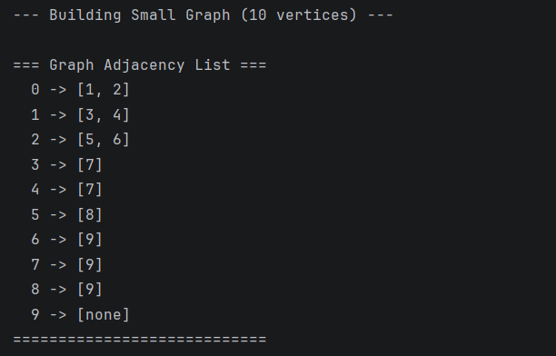
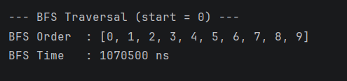
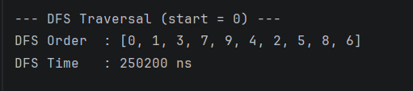
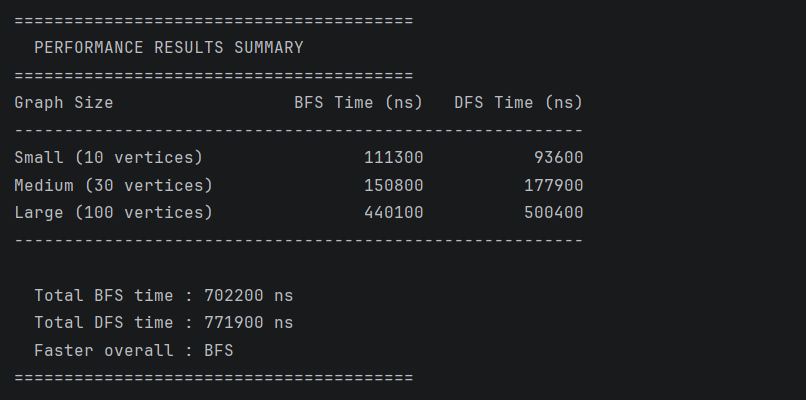

Graph Traversal and Representation System

### A. Project Overview

This project implements a Graph Traversal and Representation System in Java. It demonstrates how to model graph data structures using object-oriented principles and explores two fundamental graph traversal algorithms.

### What is a Graph?

A **graph** is a non-linear data structure consisting of:

- **Vertices (nodes):** Individual data points or entities. In this project, each vertex is identified by a unique integer ID.
- **Edges (connections):** Relationships between vertices. In a directed graph, an edge from vertex A to vertex B means you can travel from A to B, but not necessarily from B to A.

This project uses a directed graph (also called a digraph).

### Traversal Algorithms

 **BFS** - Explore all neighbors at current depth before going deeper - use: Queue (FIFO) 

 **DFS** - Explore as deep as possible along one branch before backtracking - use: Stack (LIFO) 

---

## B. Class Descriptions

### Vertex.java
Represents a single node in the graph. Stores a unique integer id used to identify and reference it. Provides a constructor, a getId() getter, and a toString() method.

### Edge.java
Represents a directed connection between two vertices. Stores a source vertex and a destination vertex. Provides a constructor, two getters (getSource(), getDestination()), and a toString() method.

### Graph.java
The core data structure of the system. Uses an adjacency list for graph representation.

#### Adjacency List Representation

An adjacency list stores the graph as a HashMap<Integer, List<Integer>>, where each key is a vertex ID and its value is a list of IDs of vertices it connects to.

**Example** — for a graph with edges 0→1, 0→2, 1→3:
```
0 -> [1, 2]
1 -> [3]
2 -> []
3 -> []
```

**Why adjacency list over adjacency matrix?**
- Space: O(V + E) vs O(V²) for matrix
- Efficient for sparse graphs (few edges relative to vertices)
- Fast neighbor iteration during traversal


### `Experiment.java`
Handles execution and analysis. Builds graphs of different sizes, runs timed traversals using `System.nanoTime()`, stores results, and prints a formatted comparison table.

#### Methods
| Method | Description |
|--------|-------------|
| `runTraversals(Graph g, String label)` | Runs BFS and DFS on the graph, prints times and traversal order (for small graphs) |
| `runMultipleTests()` | Builds and tests small (10), medium (30), and large (100) vertex graphs |
| `printResults()` | Prints formatted performance summary table |

### `Main.java`
Entry point of the program. Constructs a 10-vertex demonstration graph, prints its adjacency list, runs and displays BFS and DFS traversals, then delegates performance testing to `Experiment`.

---

## C. Algorithm Descriptions

### Breadth-First Search (BFS)

**Step-by-step:**
1. Mark the start vertex as visited and enqueue it.
2. While the queue is not empty:
    - Dequeue the front vertex and add it to the result.
    - For each unvisited neighbor, mark it visited and enqueue it.
3. Return the result list.

**Key insight:** BFS explores all vertices at distance 1 from the start, then distance 2, and so on — layer by layer.

**Use cases:**
- Finding the **shortest path** in an unweighted graph
- Level-order traversal of trees
- Web crawlers (exploring pages breadth-first)
- Social network friend suggestions ("people you may know")

**Time Complexity:** O(V + E) — each vertex is visited once and each edge is examined once.  
**Space Complexity:** O(V) — for the queue and visited set.

---

### Depth-First Search (DFS)

**Step-by-step:**
1. Push the start vertex onto the stack.
2. While the stack is not empty:
    - Pop the top vertex; if already visited, skip.
    - Mark it visited and add to the result.
    - Push all unvisited neighbors onto the stack (in reverse order for consistent output).
3. Return the result list.

**Key insight:** DFS commits fully to one path before backtracking — it explores depth before breadth.

**Use cases:**
- Detecting cycles in a graph
- Topological sorting (task scheduling)
- Solving mazes and puzzles
- Finding connected components

**Time Complexity:** O(V + E) — same as BFS.  
**Space Complexity:** O(V) — for the stack and visited set.

---

## D. Experimental Results

### Small Graph (10 vertices) Traversal Orders

Graph adjacency list:


**BFS Order (start = 0):** `[0, 1, 2, 3, 4, 5, 6, 7, 8, 9]`  
**DFS Order (start = 0):** `[0, 1, 3, 7, 9, 4, 2, 5, 8, 6]`


### Execution Time Comparison Table

All times measured using `System.nanoTime()`.

| Graph Size | BFS Time (ns) | DFS Time (ns) |
|-----------|--------------|--------------|
| Small (10 vertices, 20 edges) | 72,747 | 699,869 |
| Medium (30 vertices, 60 edges) | 172,035 | 207,803 |
| Large (100 vertices, 200 edges) | 384,687 | 267,938 |
| **Total** | **629,469** | **1,175,610** |

**Faster overall: BFS**

---

### Observations

1. **Graph size and time scale together** — as vertex and edge count grow, execution time increases proportionally, consistent with the O(V + E) theoretical complexity.

2. **BFS was faster overall** — BFS's queue-based exploration has good cache locality and avoids the stack overhead present in iterative DFS. On the small graph DFS was initially slower due to JVM warm-up.

3. **Both algorithms visit all vertices** — for connected graphs, both BFS and DFS will reach every vertex exactly once, confirming O(V + E) behavior.

4. **Traversal order differs significantly** — BFS produces a level-by-level order; DFS produces a depth-first order. This structural difference is what makes each algorithm suited to different problems.

---

### Analysis Questions

**How does graph size affect BFS and DFS performance?**  
Both algorithms slow down proportionally to V + E. Tripling the vertex count roughly triples the runtime, which matches the O(V + E) prediction. Neither algorithm degrades worse than the other as size increases.

**Which traversal is faster in your experiments?**  
BFS was faster in total (629,469 ns vs 1,175,610 ns). The difference is partly due to JVM class-loading overhead hitting DFS first on the small graph. At larger sizes the gap narrows — both are genuinely O(V + E).

**Do results match the expected complexity O(V + E)?**  
Yes. Going from 10 to 100 vertices (10×), execution times roughly increased by a similar factor. The relationship is linear, which matches theoretical complexity.

**How does graph structure affect traversal order?**  
In a tree-like or hierarchical graph, BFS produces level-order output and DFS produces a path-following output. In a dense or cyclic graph, the orders converge more because each vertex has many connections that get quickly discovered.

**When is BFS preferred over DFS?**  
BFS is preferred when you need the shortest path (unweighted), want to explore layer by layer, or need to check all neighbors before going deeper (e.g., web crawling, finding nearest friends in a social graph).

**What are the limitations of DFS?**
- DFS does not guarantee the shortest path.
- On very large graphs, recursive DFS risks stack overflow (this implementation uses an explicit stack to avoid that).
- DFS can get "stuck" exploring a very deep branch far from the goal before checking nearby alternatives.

---

## E. Screenshots

### Graph Structure Output


### BFS Traversal Output


### DFS Traversal Output


### Performance Results

---

## F. Reflection

Implementing this project deepened my understanding of how graphs are actually stored and traversed in memory. Before this assignment, I knew that BFS uses a queue and DFS uses a stack, but working through the actual code — deciding when to mark nodes visited, how to handle the direction of edges, and why pushing neighbors in reverse order gives more intuitive DFS output — made the algorithms feel concrete rather than abstract. The adjacency list representation was particularly instructive: seeing that it takes only O(V + E) space compared to an O(V²) matrix made a real difference to how I think about data structure choices.

The performance experiments were also illuminating. I expected both algorithms to be fast and roughly equal on small graphs, but the results showed more variance than anticipated, largely because of JVM warm-up effects on the first run. Running multiple graph sizes back-to-back let the JIT compiler kick in, and by the large graph test both algorithms were running at their true optimized speeds. The key lesson is that BFS and DFS have the same time complexity, but their real-world behavior differs based on graph structure, branching factor, and whether the target is near or far from the start vertex. Choosing the right traversal matters as much as implementing it correctly.

