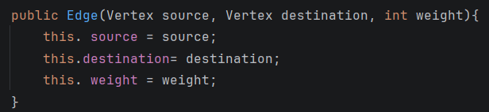
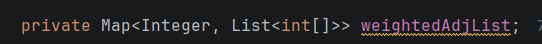
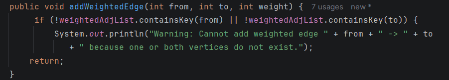
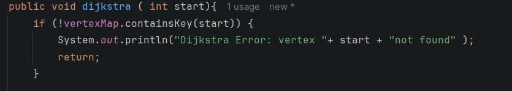

### BONUS TASK 
### What was changed 
#### Edge.java
- Added a weight field and a new constructor 

### Graph.java
- Added a weighted adjacency list

- Added a new method 

- Added the main algorithm 

### How the algorithm works 
1. set every vertex's distance to infinity, evept the start vertex (0)
2. repeat for each vertex:
- find the unvisited vertex with the smallest known distance 
- mark is visited
- relax its neighbors: is the path through the vertex is shorter, update the distance 
3. print the final shortest distance 

### Time complexity 
| Step                  | Complexity |
|-----------------------|------------|
| Finding minimum each round | O(V)       |
| Total across all vertices | O(V^2)     |
| Edge relaxation       | O(E)       |
OVERALL : O(V^2+3)